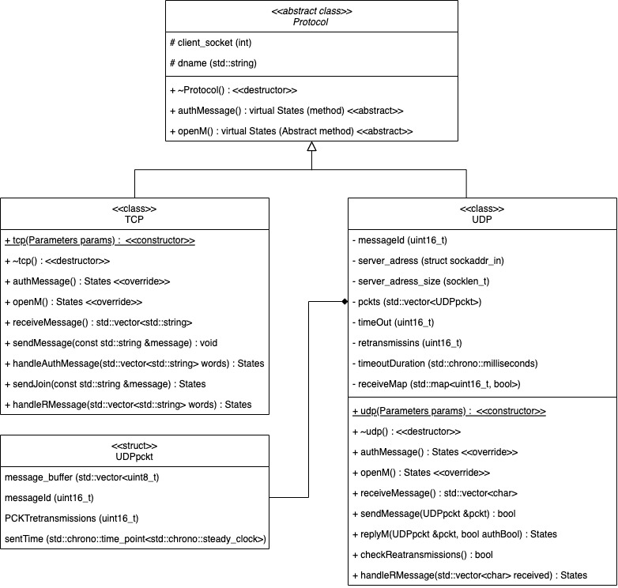
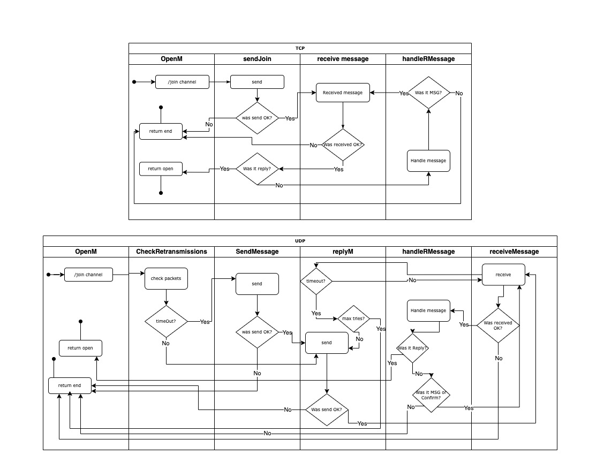

# Project Documentation

## Content Structuring

The documentation is organized into the following sections:

1. [Introduction](#1-introduction)
2. [Classes Hierarchy and Other Abstract Data Types](#2-classes-hierarchy-and-other-abstract-data-types)
3. [Executive Summary](#3-executive-summary)
4. [UML Diagrams](#4-uml-diagrams)
5. [Testing](#5-testing)
6. [Bibliography](#6-bibliography)

## 1. Introduction

- IPK Project 1: Client for a chat server using the IPK24-CHAT protocol, created by Jan Lindovský, implements communication with a remote server using TCP or UDP connection. The code is written in C++ using object-oriented programming. The program consists of four files: `main.cpp` where the client socket is created and the finite state machine is operated, `client.h` which is the only header file in the program containing all class definitions, included libraries, and other essential declarations like tructs and enum. `clientTCP.cpp` and `clientUDP.cpp` are files where methods from the `udp` and `tcp` classes are implemented.

## 2. Classes Hierarchy and Other Abstract Data Types

### Class `Protocol` (Abstract)

- `Protocol` is an abstract base class that defines the interface for different network protocols. It has a virtual destructor and two pure virtual functions: `authMessage()` and `openM()`. It also has a protected member `client_socket` and a member `dname`.

### Class `tcp` (Derived from `Protocol`)

- `tcp` is a subclass of `Protocol` representing the TCP protocol. It has a constructor that takes `Parameters` as an argument and implements the virtual functions `authMessage()` and `openM()`. Additionally, it provides methods for sending and receiving messages over TCP. The implementation of `tcp` methods is in `clientTCP.cpp`.

### Class `udp` (Derived from `Protocol`)

- `udp` is another subclass of `Protocol`, representing the UDP protocol. It has similar functionalities as `tcp`, but for UDP communication. It also has additional members specific to UDP, such as `messageId`, `server_address`, and `pckts`. It implements the virtual functions `authMessage()` and `openM()`, along with methods for sending and receiving UDP packets. The implementation of `udp` methods is in `clientUDP.cpp`.

### Struct `Parameters`

- `Parameters` is a struct used for storing parameters related to network communication given by the user as parameters when running the program, such as whether the protocol is TCP or UDP, the hostname, port number, timeout duration, and the number of retransmissions.

### Struct `UDPpckt`

- `UDPpckt` is a struct representing a UDP packet. It contains a message buffer, message ID, the number of retransmissions for the packet, and a timestamp for when the packet was last sent. This struct is used to store already sent UDP packets, ready to be sent again.

### Enum `States`

- Enumeration for the finite state machine. States are `auth`, `open`, and `end`.

## 3. Executive Summary

#### `TCP` (Transmission Control Protocol)

- TCP ensures reliable, ordered delivery of data packets between devices by establishing virtual connections, handling packet retransmission, and implementing flow control mechanisms.

#### `UDP` (User Datagram Protocol)

- UDP offers a simpler, connectionless alternative focusing on fast data delivery without guaranteeing arrival order, reliability features, or connection setup.

#### Differences between TCP and UDP

- TCP prioritizes reliability with error detection and correction, while UDP prioritizes speed and efficiency, making it suitable for real-time applications. TCP requires connection setup, whereas UDP does not, making it faster for short transactions but less suitable for continuous data transfers.

#### ipk24chat-client

- After running the program, parameters are checked and stored in the `Parameters` struct. A signal handler function is set to check if Ctrl+C is pressed. If the protocol is TCP or UDP, a new client of the derived subclass is created. The constructor of the selected transmission protocol is then called with the `Parameters` struct. In the constructor, socket, port, and server address are handled, and the program proceeds to the FSM function. The FSM function owns a finite state machine that handles the states of the program, which are defined in the `States` enum.

- The virtual method `authMessage` is called, and the user is prompted to write an authentication message. This message is controlled by regex patterns, and important data are stored in subclasses or in the virtual class `Protocol`. The packet is then sent to the server by the `handleRmessage` method (for TCP) and `replyM` method (for UDP), which are owned by one of the derived classes. These methods are responsible for waiting for a reply. In UDP, it is also responsible for handling retransmissions. If the authorization is valid, the method returns the `open` state, and the FSM proceeds to the `openM` virtual method. Otherwise, the user can be prompted again to write an authentication message, or the program transitions to the `end` state due to an incoming error message or Ctrl+C, terminating it.

- The `openM` method creates two polls, which are continuously looped for events on file descriptors: `client_socket` and `STDIN_FILENO`. In UDP, there is an extra method `checkRetransmissions` that controls and resends messages after a timeout, or it returns the `end` state to the FSM after too many retries. The two main methods, `sendMessage` and `receiveMessage`, are responsible for client-server communication. In UDP, every packet is stored in the `pckts` vector, an attribute of the `udp` class, along with its timeout. This is used to check the need for resending. To decipher incoming messages, there is a helper method `handleRmessage` that resolves the incoming message and returns a state. Udp has also map of received messages, that stores message ID in map and sets value to true. if message is second for second time, it should be inreceiveMap and program will do nothing with this packet, because action was already done.

- A significant difference between TCP and UDP is in handling the join message. TCP has a `sendJoin` method where it sends a message to the server and waits for a reply from the server, while messages are buffered in the input stream buffer. After the reply, all messages are sent to the server. In UDP, the join message is sent in the `openM` method, and then it proceeds to the `replyM` method, which is also used to handle the reply message to authentication. In `replyM`, polling is used for timeout and resending messages, or error handling after too many retries. After confirmation and reply messages, all packets are sent to the server, similar to TCP.

- With errors from server, the program will send an error message to the server and then return to the `end` state. The `end` state will terminate the FSM function. The `delete` function at the end of the program is called to send a `bye` message, close the client, and print the closing message for the user on the output stream. Internal errors will be printed as an ERR message on the standard output (stdout), and the state will be set to `end.` A `bye` message will be sent, and the connection will be gracefully terminated with a closing connection message.

## 4. UML Diagrams

### Class Diagram

  

<table align="center" cellspacing="20">
    <tbody>
        <tr>
            <td>
                <ul>
                    <li><b>-</b> `#` indicates a protected attribute</li>
                    <li><b>-</b> `+` indicates a public method</li>
                    <li><b>-</b> `-` indicates a private attribute</li>
                </ul>
            </td>
            <td>
                
Attribute template:

                <ul>
                    <li><code>[#/+/-] name (type)</code></li>
                </ul>
                
Method template:

                <ul>
                    <li><code>[#/+/-] name(parameters) : (return type)</code></li>
                </ul>
            </td>
        </tr>
    </tbody>

</table>

### Activity Diagrams, difference between join command in TCP and UDP

These two diagrams illustrate the difference between the `/join channel` command in TCP and UDP protocols. The diagrams primarily focus on the sequence of function calls and their behavior.

In the diagrams, round blocks represent function processes, while squares represent decision-making points based on the result of previous actions.

  

## 5. Testing

### Overview

- Testing was aimed to ensure that smaller phases of the program are running as intended. Both TCP and UDP protocols were tested using the Public Reference Server, anton5.fit.vutbr.cz, which was utilized for confirmation of functionality. The main tests were conducted using Netcat and PacketSender. NetCat was employed for testing the TCP protocol, where it served as the server and exchanged messages with my program. For UDP testing, PacketSender was utilized to create and transmit a series of messages. Additionally, PacketSender also functioned as a server during UDP testing. The finite state machine and every state in it were tested, also running main function and checking if sockets are correctly set.

### What was tested

1. **TCP Transmission**: The reliability and accuracy of data transmission using the TCP protocol were tested.
2. **UDP Transmission**: The efficiency and reliability of data transmission using the UDP protocol were evaluated.

For each transmission protocol, the following testing approach was employed:

- Each message type was initially tested separately to assess individual message transmission reliability and accuracy.
- Subsequently, combining multiple messages together, the transmission was tested to evaluate the protocol's performance under increased message load.

### Why it was tested

Testing each message type separately was essential to ensure incremental progress in the development of the entire project. Without verifying the functionality of each message type individually, testing for multiple messages would be useless. By testing individual message types, it could be identified and addressed issues or inconsistencies early in the development process. This approach ensured that the application's transmitting protocols could reliably handle various message types, both individually and collectively.

Testing was conducted to validate the implementation of the transmitting protocols within the application and to ensure they meet the expected standards of reliability, efficiency, and robustness. By testing these protocols, we aimed to identify and address any potential issues or vulnerabilities that could impact the performance or functionality of the application.

### How it was tested

#### TCP Transmission:

- **Setup**: NetCat was configured as the TCP server, while the application acted as the client.
- **Procedure**: Various data payloads were transmitted from NetCat to the application to evaluate the reliability of TCP transmission.
- **Tests Conducted**:
  - Basic data transmission.
  - Stress testing with large data payloads.
- **Metrics**: packet loss, syntax of messages were measured to assess the performance of TCP transmission.

#### UDP Transmission:

- **Setup**: Packet Sender served as the UDP server, while the application operated as the client.
- **Procedure**: Different data packets were sent from Packet Sender to the application to evaluate UDP transmission reliability and efficiency.
- **Tests Conducted**:
  - Basic data transmission.
  - Testing for packet loss and out-of-order delivery.
- **Metrics**: Packet loss rate, syntax of messages were measured to check the performance of UDP transmission.

After local testing using NetCat for TCP and Packet Sender for UDP, the final evaluation involved connecting the application to a public reference server (Discord). This step allowed for real-world testing scenarios and validation of the transmitting protocols' performance.

### Testing Environment

- **Hardware**:

  - MacBook Pro (13-inch, 2019)
    - Processor: 2,4 GHz 4-core Intel Core i5
    - RAM: 8 GB 2133 MHz LPDDR3
    - Network Interface: [Specify network interface card details]

- **Software**:

  - macOS Sonoma (14.4 (23E214))
  - Netcat(The GNU Netcat) 0.7.1
  - Packet Sender (v8.6.5)

- **Network Topology**:
  - Localhost: Testing was conducted on the local machine to simulate communication within a single system.
  - Discord: anton5.fit.vutbr.cz

### Inputs, Expected Outputs, and Actual Outputs

- This section is only to how how test was conducted. Many test were manually typed to terminal so this is only snippet of them.

### 1. TCP Authentication, Rename, and Message Test

#### Client stdin:

- /auth xlindo04 123456 JL

#### Server stdout:

- AUTH xlindo04 AS JL USING 123456

#### Server stdin:

- REPLY OK IS authorization

#### Client stdout:

- expected: Success: authorization
- actual: Success: authorization

#### Client stdin:

- /rename JOHN
- hello

#### Server stdout:

- expected: MSG FROM JOHN IS hello
- actual: MSG FROM JOHN IS hello

#### Client Ctrl-c pressed:

- expected response: Closing connection
- actual response: Closing connection

#### Server stdout:

- expected: BYE
- actual: BYE

### 2. TCP Authentication, Join, and Message Test

#### Client stdin:

- /auth xlindo04 123456 JL

#### Server stdout:

- AUTH xlindo04 AS JL USING 123456

#### Server stdin:

- REPLY OK IS authorization

#### Client stdout:

- expected: Success: authorization
- actual: Success: authorization

#### Client stdin:

- /join channel
- hello

#### Server stdout:

- expected: JOIN channel AS JL
- actual: JOIN channel AS JL

#### Server stdin:

- REPLY OK IS success content

#### Client stdout:

- expected: Success: content
- actual: Success: content

#### Server stdout:

- expected: MSG FROM JL IS hello
- actual: MSG FROM JL IS hello

#### Client Ctrl-c pressed:

- expected response: Closing connection
- actual response: Closing connection

#### Server stdout:

- expected: BYE
- actual: BYE

### 3. UDP Authentication confirm timeout

#### client stdin:

- /auth xlindo04 123456 JL

#### Server stdout:

- expected: \02\00\00xlindo04\00JL\00123456\00
- actual: \02\00\00xlindo04\00JL\00123456\00
- expected: \02\00\00xlindo04\00JL\00123456\00
- actual: \02\00\00xlindo04\00JL\00123456\00
- expected: \02\00\00xlindo04\00JL\00123456\00
- actual: \02\00\00xlindo04\00JL\00123456\00
- expected: \02\00\00xlindo04\00JL\00123456\00
- actual: \02\00\00xlindo04\00JL\00123456\00

#### client stdout:

- closing conection

#### Server stdout:

- expected: \ff\00\01
- actual: \ff\00\01
- expected: \ff\00\01
- actual: \ff\00\01
- expected: \ff\00\01
- actual: \ff\00\01
- expected: \ff\00\01
- actual: \ff\00\01

## 6. Bibliography

[1] RFC 9293: The Wire Image of a Network Protocol - [RFC 9293](https://www.ietf.org/rfc/rfc9293.html). Last accessed on March 30, 2024.  
[2] RFC 768: User Datagram Protocol (UDP) - [RFC 768](https://www.rfc-editor.org/rfc/rfc768). Last accessed on March 30, 2024.  
[3] Communication Networks/TCP and UDP Protocols (Wikibooks) - [Communication Networks/TCP and UDP Protocols (Wikibooks)](https://en.wikibooks.org/wiki/Communication_Networks/TCP_and_UDP_Protocols). Last accessed on March 30, 2024.
