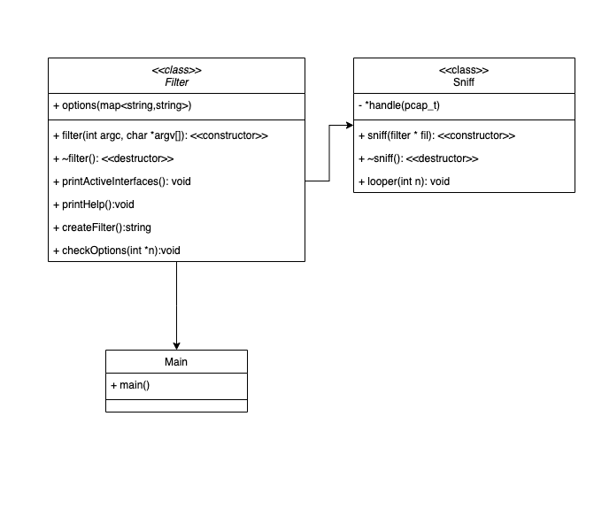

## IPK project 2 - Packet Sniffer Program Documentation

Author: Jan Lindovský

### Table of Contents

- [Introduction](#introduction)
- [Executive Summary](#executive-summary)
  - [Packet Capture Basics](#packet-capture-basics)
  - [Command-Line Options and Filters](#command-line-options-and-filters)
  - [Networking Protocols and Headers](#networking-protocols-and-headers)
  - [Packet Parsing and Analysis](#packet-parsing-and-analysis)
  - [Signal Handling](#signal-handling)
- [Functionality](#functionality)
- [Classes and Flow](#classes-and-flow)
  - [Class `filter`](#class-filter)
  - [Class `sniff`](#class-sniff)
  - [Handling Flow](#handling-flow)
  - [Main Function](#main-function)
- [Class Diagram](#class-diagram)
- [Testing](#testing)
- [Bibliography](#bibliography)

### Introduction

This program is a packet sniffer implemented in C++ using the libpcap library. It captures network packets from a specified interface and provides various filtering and analysis functionalities.

### Executive Summary

#### Packet Capture Basics

- **Libpcap:** A portable C/C++ library for network traffic capture.
- **Packet Sniffing:** The process of intercepting and logging network traffic.
- **Promiscuous Mode:** A mode in which a network interface card (NIC) captures all traffic on the network segment, regardless of the destination.

#### Command-Line Options and Filters

- **Command-Line Arguments:** Parameters passed to a program when it's executed.
- **Filter Expressions:** Rules defining which packets to capture based on various criteria like protocol type, source/destination IP, port numbers, etc.
- **BPF (Berkeley Packet Filter):** A filtering mechanism used by libpcap to optimize packet selection.

#### Networking Protocols and Headers

- **Ethernet:** The most widely used LAN technology.
- **IP (Internet Protocol):** The principal communications protocol in the Internet protocol suite.
- **IPv4 and IPv6:** Two versions of the Internet Protocol.
- **TCP (Transmission Control Protocol) and UDP (User Datagram Protocol):** Key transport layer protocols.
- **ARP (Address Resolution Protocol):** Used for mapping IP addresses to MAC addresses.
- **ICMP (Internet Control Message Protocol):** Used for network management and troubleshooting. [[1]](#1)

#### Packet Parsing and Analysis

- **Packet Headers:** Structured data at the beginning of each packet containing essential information about the packet.
- **Data Link Layer:** The lowest layer of the OSI model responsible for physical transmission.
- **Network Layer:** Layer responsible for routing packets across networks.
- **Transport Layer:** Layer responsible for delivering data to the appropriate application.

#### Signal Handling

- **Signal Handling:** The process of handling interrupts or exceptions triggered by software or hardware events.
- **SIGINT:** The signal generated by the user pressing Ctrl+C to interrupt the program.

### Functionality

- **Capture Packets:** The program captures network packets from a specified network interface in real-time.
- **Filtering:** It provides various filtering options to filter packets based on different criteria such as protocol type (TCP, UDP, ICMPv6, ARP, NDP, IGMP, MLD), port numbers, etc.
- **Packet Analysis:** It analyzes captured packets and extracts relevant information such as MAC addresses, IP addresses, protocol types, ports, and payload data.
- **User Interaction:** The program provides a command-line interface with options to specify the network interface, filter criteria, and number of packets to capture.
- **Error Handling:** It includes error handling mechanisms to handle errors related to interface opening, filter compilation, etc.

### Classes and Flow

#### Class `filter`

The `filter` class is responsible for parsing command-line arguments, validating options, and generating packet filtering expressions. It encapsulates the logic related to setting up packet filters based on user-specified criteria.

##### Member Variables:

- `options`: A map containing command-line options and their corresponding values.

##### Constructor:

- `filter(int argc, char *argv[])`: Parses command-line arguments and populates the `options` map accordingly.

##### Methods:

- `printActiveInterfaces()`: Prints a list of active network interfaces.
- `printHelp()`: Prints program help information.
- `createFilter()`: Generates a BPF expression based on the specified options.
- `checkOptions(int *n)`: Validates command-line options and sets the packet count limit if specified.

#### Class `sniff`

The `sniff` class is responsible for capturing packets from the network interface, applying filters, and invoking the packet handler function. It manages the packet capture session and handles the flow of packet processing.

##### Member Variables:

- `handle`: A pointer to the pcap_t structure representing the packet capture session.

##### Constructor:

- `sniff(filter *fil)`: Initializes the packet capture session and sets up packet filtering based on the provided `filter` object.

##### Methods:

- `looper(int n)`: Enters the packet capture loop, capturing and processing packets until the specified packet count limit is reached.
- Destructor: Cleans up resources and closes the packet capture

session.

#### Handling Flow

1. **Command-line Parsing**: The program starts by parsing command-line arguments using the `filter` class. Options are validated, and corresponding actions are taken based on the provided arguments, such as printing help information, listing active interfaces, or setting up packet filters.

2. **Packet Capture Setup**: An instance of the `sniff` class is created, which initializes the packet capture session and sets up packet filtering based on the options parsed earlier.

3. **Packet Capture Loop**: The program enters a loop to capture packets using the `pcap_loop` function. Each captured packet is passed to the `handlePacket` function for processing.

4. **Packet Processing**: The `handlePacket` function extracts relevant information from the captured packet and prints it to the console. This includes details such as MAC addresses, IP addresses, ports, and payload data.

5. **Signal Handling**: The program registers a signal handler function to handle interruptions (e.g., Ctrl+C). When a termination signal is received, the packet capture session is closed gracefully, and resources are released.

#### Main Function

The `main` function operates the overall flow of the program. It creates instances of the `filter` and `sniff` classes, sets up signal handling, and initiates the packet capture loop.

### Class Diagram



### Testing

#### Method

The program was tested by running it with various command-line options and comparing the output format with the Functionality Illustration provided in the documentation.

#### Steps

1. **Execution**: The program was executed with different combinations of command-line options, such as specifying network interfaces, filtering criteria (e.g., TCP, UDP), and packet count.
2. **Capturing Output**: The output generated by the program during packet capture was captured and saved.
3. **Comparison**: The captured output was compared against the expected output format described in the Functionality Illustration section of the documentation.
4. **Verification**: The output was manually inspected to ensure that it matched the expected format and contained the relevant packet details, such as MAC addresses, IP addresses, ports, and payload data.

#### Testing Environment

- **Hardware**:
  - MacBook Pro (13-inch, 2019)
    - Processor: 2,4 GHz 4-core Intel Core i5
    - RAM: 8 GB 2133 MHz LPDDR3
    - Network Interface: [Specify network interface card details]
- **Software**:
  - macOS Sonoma (14.4 (23E214))

#### Tests

1. number of packets:

- input: sudo ./ipk-sniffer -i en0 -t -n 10
- expected output: 10 packets
- output were 10 packets with every output data needed

2. TCP protocol:

- input: sudo ./ipk-sniffer -i en0 -t
- expected tcp packet
- output:

```
Timestamp: 2024-04-22 21:36:31
src MAC: 38:f9:d3:ac:21:a9
dst MAC: f0:87:56:c8:c3:c0
Frame Length: 262 bytes
src IP: 162.159.135.234
dst IP: 10.0.0.7
src Port: 443
dst Port: 62101

0x0000: 38 f9 d3 ac 21 a9 f0 87 56 c8 c3 c0 08 00 45 00 8...!...V.....E.
0x0010: 00 f8 b8 71 40 00 3a 06 52 fe a2 9f 87 ea 0a 00 ...q@.:.R.......
0x0020: 00 07 01 bb f2 95 92 c2 6a 96 b0 c8 c6 b0 80 18 ........j.......
0x0030: 00 08 93 34 00 00 01 01 08 0a 80 b4 0a 0b 34 63 ...4..........4c
0x0040: ec 22 17 03 03 00 bf 9f 2f 55 98 2b 7d 37 c1 ee ."....../U.+}7..
0x0050: eb 0e 2f 65 ea 34 d2 51 09 71 7a 82 d2 7e 70 11 ../e.4.Q.qz..~p.
0x0060: ed 38 91 6e 9d 34 23 6d 80 89 5d 60 74 2f 6b 78 .8.n.4#m..]`t/kx
0x0070: 89 dd 58 fc 39 14 54 25 b0 ff cf 29 dd 4b 92 f3 ..X.9.T%...).K..
0x0080: 85 7f 81 cb f8 f1 eb dc e1 cc b1 57 cb 17 84 4e ...........W...N
0x0090: e4 aa c6 b8 ff 25 f9 62 72 f3 2f 04 db 08 30 be .....%.br./...0.
0x00a0: cb 30 e8 7e dd 61 10 ec 80 dd bc 08 ad f5 bc 11 .0.~.a..........
0x00b0: 00 f4 71 c4 09 74 db 74 0c 9f 26 9e 14 25 cf 04 ..q..t.t..&..%..
0x00c0: 10 2d b8 45 19 c0 80 27 54 e3 b6 49 84 b5 d7 08 .-.E...'T..I....
0x00d0: a0 00 b3 e3 cb 31 b1 36 43 eb 1b d0 23 57 68 95 .....1.6C...#Wh.
0x00e0: 15 dc 1d da 3f 95 d7 43 51 e0 0f 3b fd 16 83 3b ....?..CQ..;...;
0x00f0: 4f a1 9c e9 41 e7 8e d1 bd fd f1 5e 1f e5 6e f6 O...A......^..n.
0x0100: c1 0d 8f 75 ea 20
```

- TCP is commonly associated with port 443, which is the default port for HTTPS (HTTP over SSL/TLS),a secure communication protocol widely used for web browsing and other applications requiring secure data transmission.

3. UDP protocol:

- input: sudo ./ipk-sniffer -i en0 -u
- expected udp packet
- output:

```
Timestamp: 2024-04-22 21:38:11
src MAC: f0:87:56:c8:c3:c0
dst MAC: 38:f9:d3:ac:21:a9
Frame Length: 85 bytes
src IP: 10.0.0.7
dst IP: 10.0.0.138
src Port: 58574
dst Port: 53

0x0000: f0 87 56 c8 c3 c0 38 f9 d3 ac 21 a9 08 00 45 00 ..V...8...!...E.
0x0010: 00 47 c1 84 00 00 40 11 a4 91 0a 00 00 07 0a 00 .G....@.........
0x0020: 00 8a e4 ce 00 35 00 33 97 9e f8 4c 01 00 00 01 .....5.3...L....
0x0030: 00 00 00 00 00 00 07 63 6c 69 65 6e 74 73 06 63 .......clients.c
0x0040: 6f 6e 66 69 67 06 6f 66 66 69 63 65 03 6e 65 74 onfig.office.net
0x0050: 00 00 41 00 01 ..A..
```

- Port 53 is commonly associated with the DNS (Domain Name System) service. DNS typically uses UDP for standard DNS queries and responses.

4. ARP protocol:

- input: sudo ./ipk-sniffer -i en0 --arp
- expected arp packet
- output:

```
Timestamp: 2024-04-22 21:43:23
src MAC: 38:f9:d3:ac:21:a9
dst MAC: f0:87:56:c8:c3:c0
Frame Length: 42 bytes
src IP: 10.0.0.138
dst IP: 10.0.0.7

0x0000: 38 f9 d3 ac 21 a9 f0 87  56 c8 c3 c0 08 06 00 01    8...!...V.......
0x0010: 08 00 06 04 00 02 f0 87  56 c8 c3 c0 0a 00 00 8a    ........V.......
0x0020: 38 f9 d3 ac 21 a9 0a 00  00 07                      8...!.....
```

-The packet is 42 bytes in length, which is consistent with the typical size of an ARP packet.
The Ethernet frame contains an ARP header, indicated by the EtherType field in the Ethernet frame being 0x0806, which corresponds to ARP according to the EtherType protocol identifier.

### Bibliography

<a id="1">[1]</a> "PCAP Filter Syntax." KaitoTek. [PCAP Filter Syntax](https://www.kaitotek.com/resources/documentation/concepts/packet-filter/pcap-filter-syntax). Last accessed on 22.4.2024.
